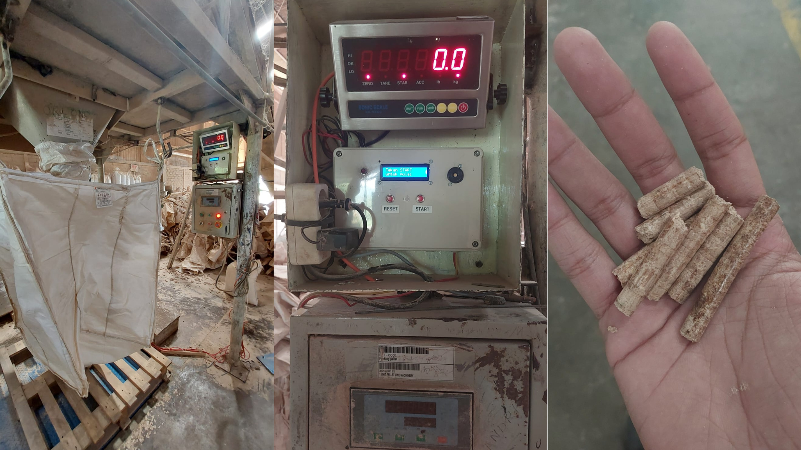
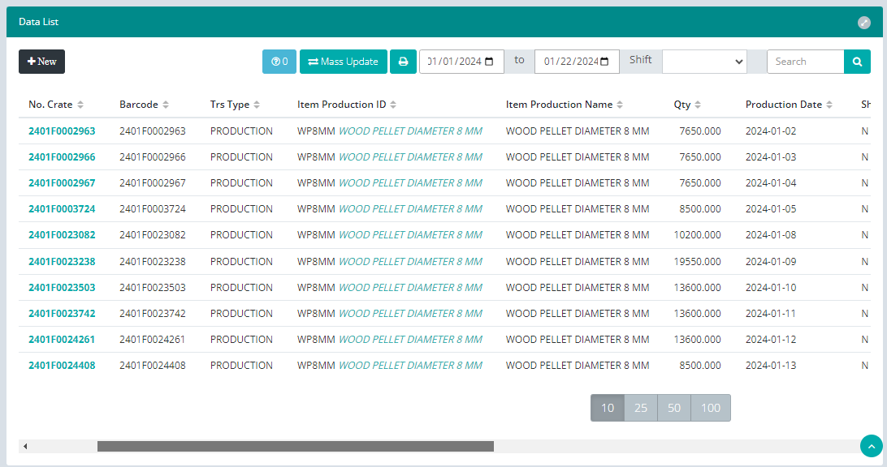
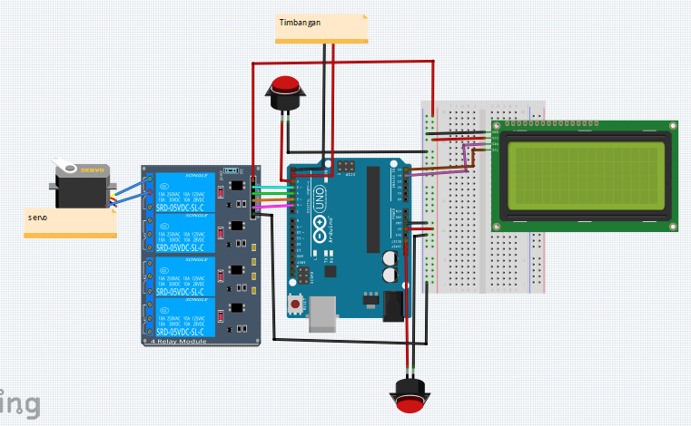

# Pellet Transaction

## Deskripsi Proyek

Pellet Transaction adalah proyek yang bertujuan untuk mengotomatisasi proses pencatatan dan manajemen stok barang berbasis berat menggunakan Arduino Uno, servo, dan timbangan. Proyek ini terdiri dari dua komponen utama, yaitu:

1. **Website**
   
   - Sebuah platform web Laravel + Angular yang berfungsi sebagai antarmuka pengguna untuk melihat dan mengelola data transaksi serta stok barang.
   - Mengintegrasikan database untuk menyimpan data transaksi secara real-time.
   - Menghasilkan kode barang otomatis berdasarkan berat yang diukur.

3. **IoT (Internet of Things)**

   
   - Menggunakan Arduino Uno sebagai otak dari sistem ini.
   - Memanfaatkan servo dan timbangan untuk mengukur berat barang.
   - Mengirimkan data berat secara real-time ke database website.

## Komponen Proyek

### Perangkat Keras (IoT)
- Arduino Uno
- Servo Motor
- Timbangan
- Kabel dan konektor

### Perangkat Lunak (Website)
- Angular untuk antarmuka pengguna
- Database MySQL untuk menyimpan data transaksi dan stok barang
- Framework Laravel untuk mengelola koneksi database dan operasi logika

## Cara Kerja

1. **Pengukuran Berat Barang**
   - Arduino Uno mengontrol servo untuk membuka timbangan.
   - Barang ditempatkan di timbangan, dan beratnya diukur.
   - Data berat dikirimkan ke database secara real-time.

2. **Manajemen Data di Website**
   - Website menampilkan data transaksi dan stok barang secara real-time.
   - Otomatis menghasilkan kode barang berdasarkan berat yang diukur.
   - Memungkinkan pengguna untuk melihat riwayat transaksi dan stok barang.

3. **Otomatisasi Pembuatan Kode Barang**
   - Berdasarkan berat yang diukur, website secara otomatis membuat kode barang.
   - Kode barang ini kemudian ditambahkan ke stok barang.

## Keuntungan

- **Tanpa Man Power:** Tidak diperlukan tenaga manusia untuk mencatat berat barang atau membuat kode barang. Semua proses diotomatisasi.
- **Real-Time Monitoring:** Data transaksi dan stok barang dapat dipantau secara langsung melalui antarmuka website.
- **Efisiensi:** Proses yang cepat dan efisien dalam manajemen stok dan pencatatan transaksi.

